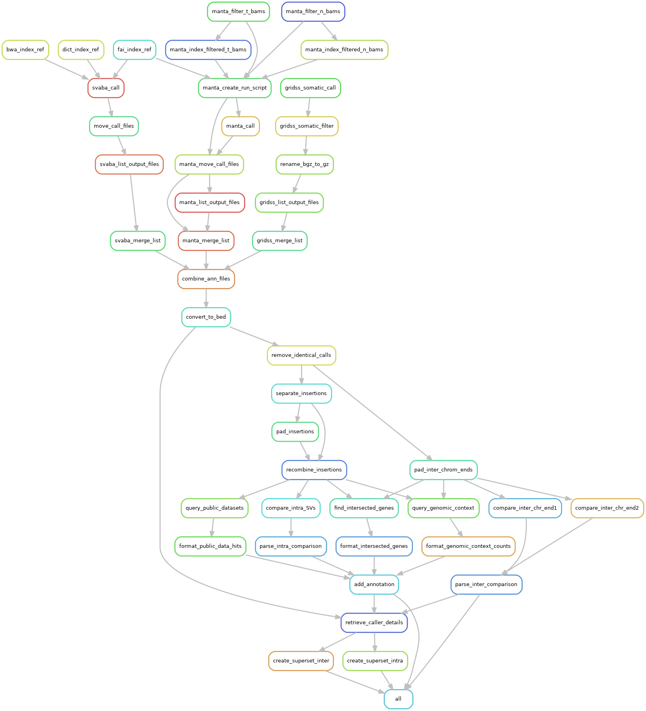

## Run MineSV demo at Biowulf

### Introduction

This tutorial is to guide users to install and run *MineSV* using the Slurm workload management at [Biowulf](https://hpc.nih.gov/docs/userguide.html).  We are going to run three SV calls via *MineSV*: svaba, manta and gridss on one set of normal/tumor paired next-generation sequencing data. 

### Installation 

#### Start to make the folder for this tutorial 

<pre>
export DEMO_DIR=/data/<mark>yourusername</mark>/MineSV_Demo_at_Biowulf
</pre>

```bash
mkdir -p $DEMO_DIR; cd $_

```

#### Clone *MineSV* from github

```bash
git clone https://github.com/NCI-CGR/MineSV

```

#### Add annotation data set to MineSV

Due to the file size limit in the github, we deposit the annotation component of MineSV to Zenodo <a href="https://doi.org/10.5281/zenodo.5176148"></a>.  And we need to add this component to the MineSV clone before running this snakeamke pipeline.

```bash

wget -O MineSV_annotation.tgz https://zenodo.org/record/5176148/files/MineSV_annotation.tgz?download=1

tar xvfz  MineSV_annotation.tgz -C MineSV

tree MineSV/annotation
MineSV/annotation
├── genes
│   ├── b37
│   │   └── RefSeq.bed
│   ├── hg19
│   │   └── RefSeq.bed
│   └── hg38
│       └── RefSeq.bed
├── genomic_context
│   ├── b37
│   │   ├── RepeatMasker.bed
│   │   ├── SegDups.bed
│   │   └── Telo_Centro.bed
│   ├── hg19
│   │   ├── RepeatMasker.bed
│   │   ├── SegDups.bed
│   │   └── Telo_Centro.bed
│   └── hg38
│       ├── RepeatMasker.bed
│       ├── SegDups.bed
│       └── Telo_Centro.bed
├── human_b37.genome
├── human_hg19.genome
├── human_hg38.genome
└── public_datasets
    ├── b37
    │   ├── 1KG.bed
    │   ├── ClinGen.bed
    │   ├── ClinVar.bed
    │   └── DGV.bed
    ├── hg19
    │   ├── 1KG.bed
    │   ├── ClinGen.bed
    │   ├── ClinVar.bed
    │   └── DGV.bed
    └── hg38
        ├── 1KG.bed
        ├── ClinGen.bed
        ├── ClinVar.bed
        └── DGV.bed

12 directories, 27 files
```

#### Download the input sequence data set <a href="https://doi.org/10.5281/zenodo.5217570"></a>

```bash
wget -O MineSV_Demo_SeqInput.zip https://zenodo.org/record/5217570/files/MineSV_Demo_SeqInput.zip?download=1

unzip MineSV_Demo_SeqInput.zip
```

#### Check the current status

```bash
tree -L 2
.
├── bam
│   ├── normal.bam
│   ├── normal.bam.bai
│   ├── tumor.bam
│   └── tumor.bam.bai
├── MineSV
│   ├── annotation
│   ├── config.yaml
│   ├── docs
│   ├── LICENSE
│   ├── modules
│   ├── README.md
│   ├── run_pipeline_at_biowulf.sh
│   ├── run_pipeline_at_ccad.sh
│   ├── scripts
│   ├── Snakefile_SV_scaffold
│   ├── SV_wrapper.sh
│   └── TEMPLATE_singularity_recipe
├── MineSV_annotation.tgz
├── MineSV_Demo_SeqInput.zip
└── refGenomes
    └── Homo_sapiens_chr22_assembly19.fasta

7 directories, 15 files

```

------------------------------

### Configure the *MineSV* run

#### Create the directory working_dir and prepare the input file
```bash
mkdir workding_dir; cd $_

cat <<EOF > input.txt
sample1 tumor.bam normal.bam
EOF
```

#### Create the file config.yaml 

User may make a copy of the file config.yaml under the folder ../MineSV to the folder worling_dir, and make some necessary changes.  Briefly, we select the analysis mode as 'TN' for the somatic SV call from the Tumor-Normal paired samples. And we use three SV callers in this particular demo: svaba, manta and gridss.  

The revised config.yaml for this tutorial is as below: 
```yaml
#### Basic analysis parameters ####
analysisMode: 'TN'  # TN, TO, germline, de_novo
callers:            # available callers: svaba, breakdancer, delly, manta
- svaba
# - breakdancer
# - delly
- manta
- gridss

runMode:
  callAndAnnotate: yes
  callOnly: no
  annotateOnly: no
refGenome: '../refGenomes/Homo_sapiens_chr22_assembly19.fasta'
genomeBuild: 'b37'  # for MineSV annotation

#### Annotation parameters ####
annotateFile: # only needed if runMode: annotateOnly
annotationParams:
  interchromPadding: 50
  insertionPadding: 500
  crossCallerOverlap: 0.7
  genomicContextOverlap: 0.7
  publicDataOverlap: 0.7

#### Samples to analyze ####
inFile: 'input.txt'

#### Directories ####
inDir: '../bam'
execDir: '../MineSV'
outDir: 'output'
logDir: 'output/logs'
tempDir: 'tmp'

#### Cluster parameters ####
clusterMode: " sbatch  -p norm -e logs/slurm-%j.err -o logs/slurm-%j.out --cpus-per-task={threads}  -t 200:00:00 --mem=40g "
latency: 600
maxNumJobs: 40
maxThreads:
- 4
# - 1
# - 1
- 4
- 8 
```

#### Copy the scripts SV_wrapper.sh and run_pipeline.sh

SV_wrapper.sh is a wrapper shell script to help users to launch the MineSV pipeline, and run_pipeline.sh is another helper script to submit SV_wrapper.sh as a slurm job itself.

```bash
cd $DEMO_DIR/workding_dir 

cp ../MineSV/SV_wrapper.sh .
cp ../MineSV/run_pipeline_at_biowulf.sh run_pipeline.sh
```

------------------------------

### Run the MineSV snakemake pipeline

#### Start an interactive session at Biowulf (~ 2 minutes)

This process may take several minutes and you will get a new shell prompt something similar to "(base) [zhuw10@cn0853 workding_dir]$ ", where cnXXXX indicates the computer node that has just been allocated to you (more details about sinteractive is available at [here](https://hpc.nih.gov/docs/userguide.html#int)).  We use the interactive session for the subsequent operations.

```bash
sinteractive --time=2160 --mem=8g --cpus-per-task=4

```

#### Generate the rulegraph plot of MineSV
```bash
cd $DEMO_DIR/workding_dir 

module load git/2.30.1 python/3.7 perl/5.24.3 snakemake/5.24.1 singularity/3.7.4 samtools/1.11

mkdir -p tmp/dummy output/logs logs

conf=config.yaml snakemake -s ../MineSV/Snakefile_SV_scaffold --rulegraph | dot -Tpng > dag.png

display dag.png # Try it if you have set up X11 and ssh properly
```



#### Build indices for the new reference genome Homo_sapiens_chr22_assembly19.fasta (optional, ~15 minutes)

The building of reference genome indices is part of the MineSV pipeline and will be processed by default if any of the indices is not available.  We take this step is to demonstrate that how the running details is wrapped by the scripts ***SV_wrapper.sh*** and ***run_pipeline.sh***.

```bash
conf=config.yaml snakemake --cores 10  -p --latency-wait 10 \
    -s ../MineSV/Snakefile_SV_scaffold  --use-singularity \
    --singularity-args "-B tmp:/scratch,../refGenomes:/ref,../MineSV/:/exec" \
    --cluster " sbatch -p norm -e logs/slurm-%j.err -o logs/slurm-%j.out --cpus-per-task={threads} -t 200:00:00 --mem=8g " \
    -U bwa_index_ref fai_index_ref dict_index_ref 

```

#### Run MineSV (>30 minutes)

The launch of the MineSV pipeline has been simiplified by the use of the script run_pipeline.sh : 

```bash
cd $DEMO_DIR/workding_dir
. run_pipeline.sh
```

Users may get the standard output something like the following: 

```console
-] Unloading git 2.30.1  ... 
[+] Loading git 2.30.1  ... 
[-] Unloading python 3.7  ... 
[+] Loading python 3.7  ... 
[-] Unloading perl 5.24.3 on cn0853 
[+] Loading perl 5.24.3 on cn0853 
[-] Unloading snakemake  5.24.1 
[+] Loading snakemake  5.24.1 
[-] Unloading singularity  3.7.4  on cn0853 
[+] Loading singularity  3.7.4  on cn0853 
[-] Unloading samtools 1.11  ... 
[+] Loading samtools 1.11  ... 
Command run: sbatch -t 200:00:00 --export=ALL --mem=32g -p norm -o /data/zhuw10/repeat/MineSV_Demo_at_Biowulf/workding_dir/SV_wrapper.sh.o%j --wrap='/data/zhuw10/repeat/MineSV_Demo_at_Biowulf/workding_dir/SV_wrapper.sh /data/zhuw10/repeat/MineSV_Demo_at_Biowulf/workding_dir/config.yaml' 
21390543
```


------------------------------

### Inspect MineSV output files

We have already packed the MineSV output from this tutorial run into a zip file, together with the full MineSV pipeline, the sequencing input data and the corresponding reference genome.  The zipped file is available at [](https://doi.org/10.5281/zenodo.5213041).


<pre>
export DEMO_FINAL=/data/<mark>yourusername</mark>/MineSV_Demo_Final
</pre>


```bash
mkdir -p $DEMO_FINAL; cd $_

### It may take about 2 hours to download the dataset from Zenodo 
wget https://zenodo.org/record/5213041/files/MineSV_Demo_at_Biowulf.zip?download=1 -O MineSV_Demo_at_Biowulf.zip

unzip MineSV_Demo_at_Biowulf.zip
```

#### The original output files from the SV callers
The original outputs from the SV callers are available in the folder ***\<caller\>_TN*** under the working directory:

```bash
tree -L 2 MineSV_Demo_at_Biowulf/working_dir/*_TN/
MineSV_Demo_at_Biowulf/working_dir/gridss_TN/
├── gridss.tmp.sample1.vcf.gz.tbi
├── sample1.assembly.bam
├── sample1_full.vcf.gz
├── sample1_full.vcf.gz.tbi
├── sample1_somatic.vcf.gz
├── sample1_somatic.vcf.gz.tbi
├── sample1.vcf.gz
└── sample1_workingdir
    ├── gridss.full.20210812_093540.cn0882.47808.log
    ├── libsswjni.so
    ├── normal.bam.gridss.working
    ├── sample1.assembly.bam.gridss.working
    ├── sample1.vcf.gz.gridss.working
    └── tumor.bam.gridss.working
MineSV_Demo_at_Biowulf/working_dir/manta_TN/
├── filtered_bams
│   ├── sample1_N.bam
│   ├── sample1_N.bam.bai
│   ├── sample1_T.bam
│   └── sample1_T.bam.bai
└── sample1
    ├── results
    ├── runWorkflow.py
    ├── runWorkflow.py.config.pickle
    ├── workflow.error.log.txt
    ├── workflow.exitcode.txt
    └── workflow.warning.log.txt
MineSV_Demo_at_Biowulf/working_dir/svaba_TN/
└── calls
    ├── sample1.alignments.txt.gz
    ├── sample1.bps.txt.gz
    ├── sample1.contigs.bam
    ├── sample1.discordant.txt.gz
    ├── sample1.log
    ├── sample1.svaba.germline.indel.vcf
    ├── sample1.svaba.germline.sv.vcf
    ├── sample1.svaba.somatic.indel.vcf
    ├── sample1.svaba.somatic.sv.vcf
    ├── sample1.svaba.unfiltered.germline.indel.vcf
    ├── sample1.svaba.unfiltered.germline.sv.vcf
    ├── sample1.svaba.unfiltered.somatic.indel.vcf
    └── sample1.svaba.unfiltered.somatic.sv.vcf

9 directories, 31 files

```

####  SV comparison and annotateion results from MineSV

Running in callAndAnnotate or callOnly modes will create the directory output/compare_and_annotate. This directory contains the files intrachromosomal_SVs_\<sample\>, which contain the superset of SVs from all callers. NOTE: this is under development, and inter-chromosomal SVs are being integrated currently.

```bash
tree -L 1 MineSV_Demo_at_Biowulf/working_dir/output/compare_and_annotate/
MineSV_Demo_at_Biowulf/working_dir/output/compare_and_annotate/
├── gridss
├── interchromosomal_SVs_sample1
├── intrachromosomal_SVs_sample1
├── manta
└── svaba

3 directories, 2 files
```

